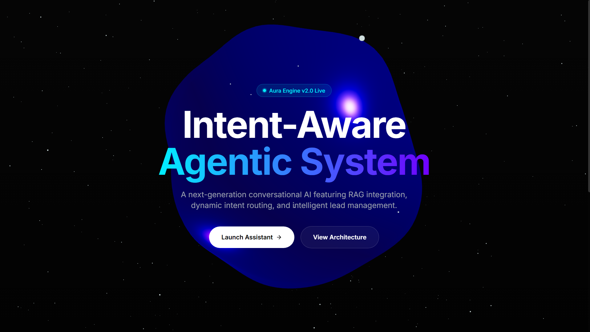

# Intent-Aware Agentic Conversational System

A production-ready conversational AI system featuring a Next.js 3D frontend and a FastAPI backend with a LangGraph-driven RAG architecture.



## Features
- **LangGraph Agent**: Utilizes a state-machine architecture for intent routing (`greeting`, `product_inquiry`, `high_intent`, etc.).
- **Local RAG Pipeline**: Zero-hallucination responses using FAISS and local `sentence-transformers` embeddings.
- **Lead Capture System**: Conditionally captures user details during high-intent conversation flows into a local SQLite database.
- **Immersive 3D UI**: Next.js App Router frontend featuring React Three Fiber for an anti-gravity 3D orb and Framer Motion for smooth transitions.

## Prerequisites
- Node.js & npm (for frontend)
- Python 3.10+ (for backend)

## Setup Instructions

### 1. Backend Setup
Navigate to the `backend` directory, set up your virtual environment, and start the FastAPI server:
```bash
cd backend
python -m venv venv
# On Windows: .\venv\Scripts\Activate.ps1
# On Mac/Linux: source venv/bin/activate
pip install -r requirements.txt
python run.py
```
> **Note**: Don't forget to configure your `OPENROUTER_API_KEY` inside `backend/.env`.

### 2. Frontend Setup
Navigate to the `frontend` directory, install dependencies, and start the Next.js server:
```bash
cd frontend
npm install
npm run dev
```

Your frontend will be running at `http://localhost:3000`.
